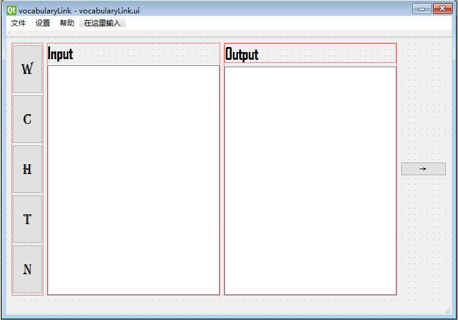
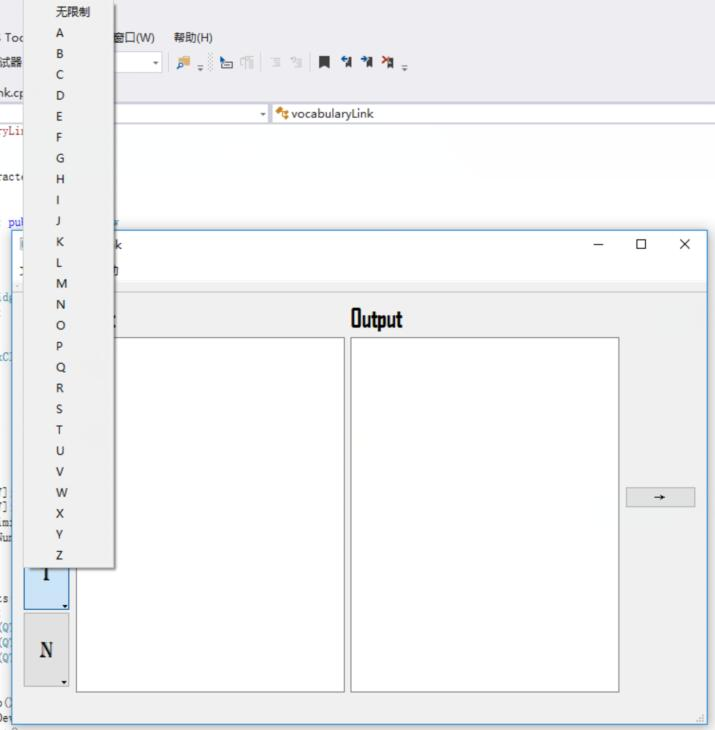
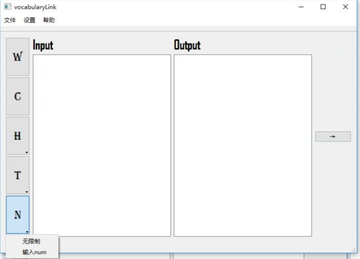
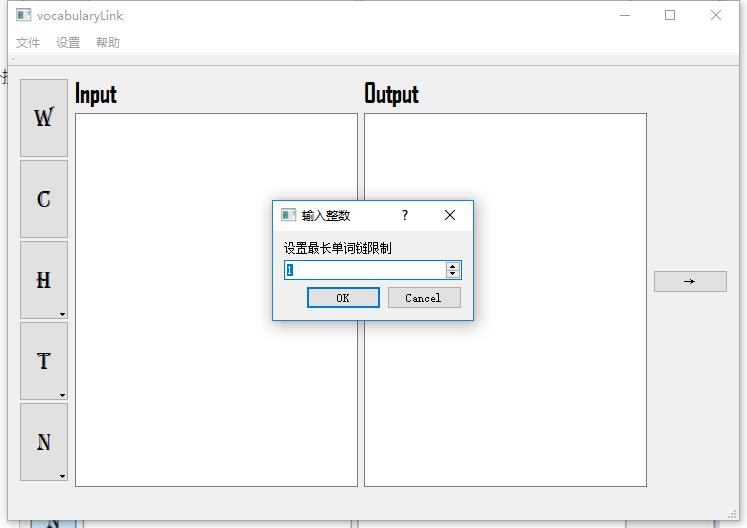
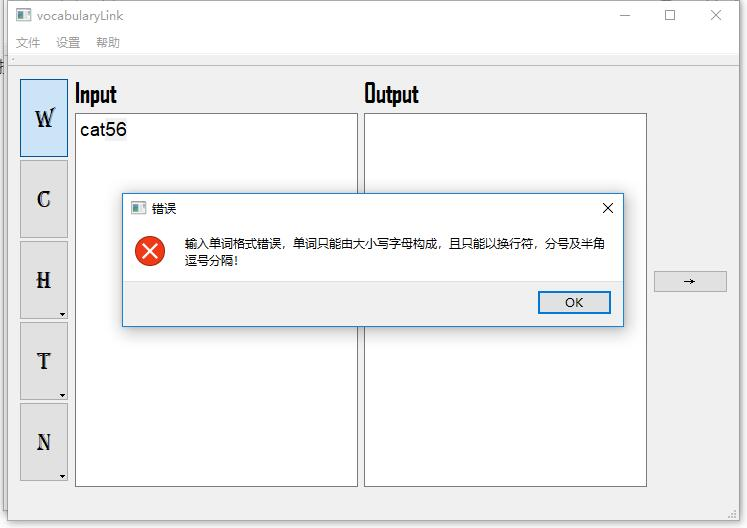
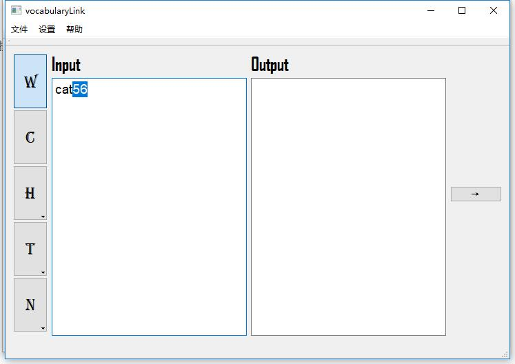
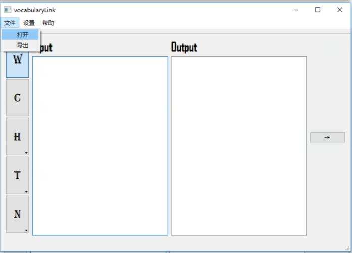
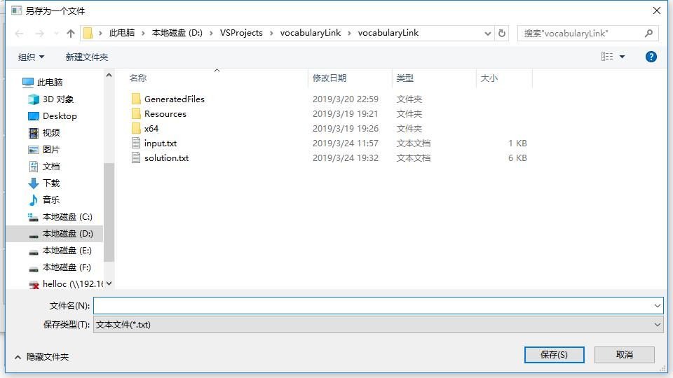
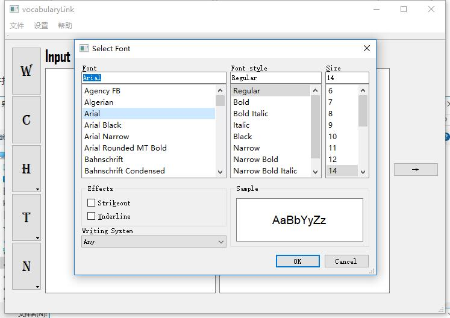
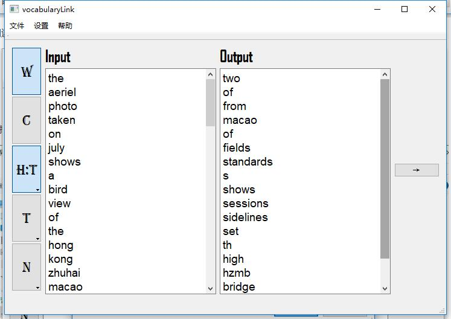

# 实验报告

## GUI设计

在 GUI 设计中，我们小组选择了使用 QT 进行开发，先下载好安装环境，在 VS 中安装 QT 插件，本项目统一用 VS 进行编译

先双击 ui 文件，用布局设计一个大致的界面：

再用 connect 函数将它们和定义的槽函数连接起来。在 GUI 的窗口类中，我们添加了五个属性

```c++
	bool w;
	bool c;
	char h;
	char t;
	int n;
```

五个属性每个对应一个按钮，代表按钮的状态，其中 w , c 的初始值是 false， 其他都是 -1 ，在连接按钮的槽函数中改变，其中我们设置了 w，c 不能同时按下，如果按下 w 再按下 c ，w会处于非按下的状态，c 处于按下的状态，同时 w， c 属性也会相应的改变。其中 h 和 t 按钮我们做了下拉菜单来选择字母，这里两个 QMenu * 设置成窗口类的属性方便析构：



五个按钮中的 n 按钮，我们用下拉菜单加输入对话窗的方式进行设置





这里面为了防止计算时间过长我们将输入的 n 限制在 1 到 50 之间。

对于左边文本框的输入我们有两种方式，一种是文件导入，一种是直接输入，为了防止用户不小心输入别的字符不小心将单词分开，我们将分割符只设置成 ， ； \n 其他非英文字符将会报错，并且光标会锁定第一个非法字符，方便用户改正输入的作物字符：



并且点击之后设置了聚焦到输入的多行文本框上：



再看另一种用文件导入，文件导入的方案中我们将分隔符设置成了所有非英文字符，这样更符合人们的需求，因为温江大多数都不是用户亲手输进去。



文件打开会弹出一个 QFileDialog 方便用户自己选取文件，同样导出也会弹出，而且设置只能保存为 txt 格式



我们还可以在设置中调整两个文本框的字体，弹出一个 QFontDialog



测试结果：



我们提供了多种错误的提示：

```c++
QString dlgTitle = "错误";
QString strInfo = QString("文件 ") + FileName + " 打开失败";
QMessageBox::critical(this, dlgTitle, strInfo);

QString dlgTitle = "错误";
QString strInfo = QString("文件 ") + FileName + " 单词数量为0";
QMessageBox::critical(this, dlgTitle, strInfo);

if (strresult == "1") {
	QString dlgTitle = "错误";
	QString strInfo = QString("Two much input file！");
	QMessageBox::critical(this, dlgTitle, strInfo);
	return;
}else if (strresult == "2") {
	QString dlgTitle = "错误";
	QString strInfo = QString("Not a valid character！");
	QMessageBox::critical(this, dlgTitle, strInfo);
	return;
}else if (strresult == "3") {
	QString dlgTitle = "错误";
	QString strInfo = QString("Word number should be a positive integer！");
	QMessageBox::critical(this, dlgTitle, strInfo);
	return;
}else if (strresult == "4") {
	QString dlgTitle = "错误";
	QString strInfo = QString("No input file！");
	QMessageBox::critical(this, dlgTitle, strInfo);
	return;
}
```

我们已经将工程打包处理，win10系统可直接运行 exe 执行文件方便检测，感谢助教认真阅读！

项目地址：https://github.com/Zhaojnbo/vocabularyLink